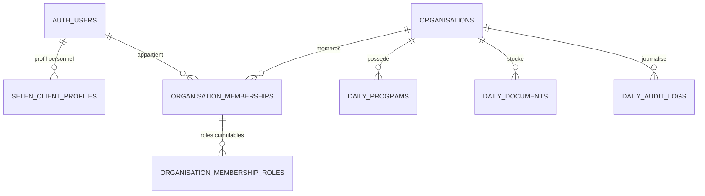

# Selen Daily — Sous-lot 1A Fondations — Rapport de conception technique

Date : 4 août 2026  
Mission : conception technique, audit complémentaire et préparation des futures migrations 1A  
Worktree : `C:\Users\Poste 1\Documents\Selen-workspace\selen-studio-daily-lot1-foundation-audit`  
Branche : `chore/daily-lot1-foundation-audit`  
Commit d’audit de départ : `5e5c8148cfc1e1fb8c51335b434fdf6e947bb38d`

## 1. Résumé exécutif

Le sous-lot 1A doit poser les fondations de Selen Daily avant tout développement métier : séparation stricte des organismes, appartenance utilisateur ↔ organisation, rôles cumulables, permissions par blocs, journal d’audit, documents versionnés, RLS, grants durcis et préparation de l’archivage.

La décision Lil n°1 change le modèle cible : `organisations` devient l’organisation canonique. Il ne faut donc pas créer de table `daily_organisations`.

L’audit complémentaire montre cependant que `organisations` n’est pas encore prête à servir de racine sécurisée Daily :

- RLS désactivée sur `public.organisations` ;
- aucune politique RLS sur `organisations` ;
- grants directs très larges pour `anon` et `authenticated`, incluant `TRUNCATE`, `REFERENCES` et `TRIGGER` ;
- table légère, sans champs juridiques complets Lot 1 ;
- création initiale absente des migrations locales visibles ;
- plusieurs tables déjà liées à `organisation_id` n’ont pas RLS activée : `dossiers`, `documents`, `formations`, `nda_variables`.

Conclusion : le sous-lot 1A est conceptuellement prêt à être transformé en mission de migrations, mais pas encore prêt à être appliqué sans une étape dédiée de sauvegardes, migration additive et tests RLS transactionnels. Haïm Levi reste strictement protégé.

## 2. État Git et environnement utilisé

Contrôles réalisés avant action :

- branche : `chore/daily-lot1-foundation-audit` ;
- HEAD : `5e5c8148cfc1e1fb8c51335b434fdf6e947bb38d` ;
- worktree propre avant création de ce rapport ;
- aucun merge, rebase ou cherry-pick détecté ;
- aucun accès au worktree principal ;
- le fichier non suivi protégé `docs/selen-global-audit-and-cleanup-plan.md` du worktree principal n’a pas été lu, déplacé, supprimé, modifié ni committé.

Actions réalisées :

- lecture complète du cahier des charges `Cahier_des_charges_Selen_Daily_Lot_1.docx` ;
- lecture complète de `docs/daily-lot1-foundation-audit.md` ;
- recherches locales ciblées ;
- introspection Supabase distante strictement en lecture seule via requêtes `SELECT`.

Actions non réalisées :

- aucune migration créée ;
- aucune migration appliquée ;
- aucun dry-run Supabase ;
- aucun `db push` ;
- aucun `INSERT`, `UPDATE`, `DELETE`, `UPSERT`, `TRUNCATE` ;
- aucune modification Auth ;
- aucune modification Storage ;
- aucun développement fonctionnel ;
- aucun push Git.

## 3. Rappel des neuf décisions Lil

1. `organisations` est la table canonique. Aucune table `daily_organisations` parallèle.
2. Une organisation représente une seule entité juridique. Les lieux de formation ne sont pas des périmètres autonomes de droits.
3. `auth.users` reste la source d’authentification ; `selen_client_profiles` reste le profil personnel général ; une nouvelle table d’appartenance relie utilisateurs et organisations.
4. Chaque formation appartient à l’organisme et doit porter `organisation_id`.
5. Les portails publics Daily restent dans Selen Vitrine ; le cockpit Selen reste dans Selen Studio.
6. La signature Lot 1 est interne, tokenisée, prouvée et sans prestataire externe en V1.
7. Les statuts transversaux sont communs, sans enum universel forcé pour tous les objets.
8. Conservation active 18 mois, archive organisée, confirmation client, suppression future 30 jours après confirmation ; aucune suppression automatique en 1A.
9. Repartir sur un modèle propre pour les fondations, conserver Daily V0 tant que la bascule n’est pas validée.

## 4. Audit complet de `organisations`

### 4.1 Colonnes distantes

Requête distante en lecture seule : `information_schema.columns`.

| Colonne | Type | Nullable | Défaut | Commentaire |
|---|---|---:|---|---|
| `id` | `uuid` | non | `gen_random_uuid()` | clé primaire |
| `name` | `text` | non | — | nom affiché |
| `siret` | `text` | oui | — | identifiant légal partiel |
| `email` | `text` | oui | — | contact générique |
| `phone` | `text` | oui | — | contact générique |
| `address` | `text` | oui | — | adresse libre |
| `nda_number` | `text` | oui | — | NDA |
| `created_at` | `timestamptz` | non | `now()` | création |
| `status` | `text` | non | `'active'` | état global |
| `archived_at` | `timestamptz` | oui | — | archive logique |
| `contact_name` | `text` | oui | — | contact |
| `company_name` | `text` | oui | — | ambigu avec `name` |
| `client_notifications_paused` | `boolean` | non | `false` | pause notifications client |

Champs absents pour Lot 1 : forme juridique, numéro TVA, adresse administrative distincte, représentant légal structuré, contact administratif structuré, logo, statut NDA détaillé, Qualiopi, dates de validité, catégories Qualiopi, rappels réglementaires.

### 4.2 Contraintes, index, triggers

Introspection distante :

- contrainte : `organisations_pkey`, `PRIMARY KEY (id)` ;
- index : `organisations_pkey` ;
- index : `organisations_client_notifications_paused_idx` sur `client_notifications_paused` ;
- trigger : aucun trigger applicatif ;
- RLS : désactivée (`relrowsecurity = false`) ;
- politiques RLS : aucune.

### 4.3 Grants

Introspection distante `information_schema.role_table_grants` :

| Rôle | Privilèges constatés |
|---|---|
| `anon` | `SELECT`, `INSERT`, `UPDATE`, `DELETE`, `TRUNCATE`, `REFERENCES`, `TRIGGER` |
| `authenticated` | `SELECT`, `INSERT`, `UPDATE`, `DELETE`, `TRUNCATE`, `REFERENCES`, `TRIGGER` |
| `service_role` | `SELECT`, `INSERT`, `UPDATE`, `DELETE`, `TRUNCATE`, `REFERENCES`, `TRIGGER` |
| `postgres` | mêmes privilèges avec grant option |

Risque : `TRUNCATE` n’est pas protégé par RLS. Comme RLS est désactivée, `organisations` ne peut pas devenir racine d’autorisation Daily sans durcissement.

### 4.4 Tables qui référencent `organisations`

Introspection distante des clés étrangères :

| Table | Colonne | Contrainte | Suppression |
|---|---|---|---|
| `documents` | `organisation_id` | `documents_organisation_fk` | `ON DELETE CASCADE` |
| `dossiers` | `organisation_id` | `dossiers_organisation_id_fkey` | `ON DELETE CASCADE` |
| `formations` | `organisation_id` | `formations_organisation_id_fkey` | `ON DELETE CASCADE` |
| `nda_variables` | `organisation_id` | `nda_variables_organisation_id_fkey` | `ON DELETE CASCADE` |
| `selen_agent_assistance_tokens` | `organisation_id` | `selen_agent_assistance_tokens_organisation_id_fkey` | `ON DELETE CASCADE` |
| `selen_agent_assistance_logs` | `organisation_id` | `selen_agent_assistance_logs_organisation_id_fkey` | `ON DELETE SET NULL` |

Conséquence : aucune suppression d’organisation ne doit être automatisée dans Daily 1A. Les cascades existantes toucheraient des dossiers, documents, formations, variables NDA et tokens d’assistance.

### 4.5 Tables avec `organisation_id`

| Table | `organisation_id` nullable | RLS distante |
|---|---:|---:|
| `documents` | oui | non |
| `dossiers` | non | non |
| `formations` | non | non |
| `nda_variables` | oui | non |
| `selen_agent_assistance_logs` | oui | oui |
| `selen_agent_assistance_tokens` | non | oui |

Ce modèle existe déjà dans Studio mais n’est pas assez sécurisé pour Daily. Il peut guider la conception, pas être copié tel quel.

### 4.6 Données présentes

Introspection distante :

| Organisation | Statut | Données liées directes | Commentaire |
---|---|---:|---|
| Haïm Levi | `active` | 0 dossier, 0 document, 0 formation, 0 variable NDA | client réel protégé |
| PR CONCEPT | `active` | 1 dossier, 3 documents, 1 variable NDA | ne pas qualifier sans décision métier |
| ROULIN Antoine | `active` | 4 dossiers, 13 documents, 1 variable NDA, 6 tokens assistance, 7 logs assistance | ne pas qualifier sans décision métier |

Haïm Levi est explicitement hors périmètre de toute future suppression ou réaffectation automatique.

### 4.7 Migrations locales liées

La création initiale de `organisations` n’a pas été trouvée dans les migrations locales visibles.

Migrations locales qui la modifient ou la référencent :

- `supabase/migrations/20260707100000_add_client_notification_pause.sql` : ajoute `client_notifications_paused`, index associé ;
- `supabase/migrations/20260707110000_create_agent_assistance_mode.sql` : crée `selen_agent_assistance_tokens` et `selen_agent_assistance_logs`, référencées à `organisations`.

Risque : l’historique local ne documente pas l’origine complète de `organisations`. Avant migration 1A, il faudra éviter toute hypothèse sur un état local incomplet et se baser sur l’introspection distante + sauvegardes.

### 4.8 Usages applicatifs observés

| Emplacement | Usage |
|---|---|
| `src/app/agent/organisations/page.tsx` | liste les organisations |
| `src/app/agent/organisations/new/page.tsx` | crée une organisation via `.from("organisations").insert(...)` |
| `src/app/agent/clients/page.tsx` | liste les clients depuis `organisations` avec dossiers |
| `src/app/agent/clients/[id]/page.tsx` | détail client et documents/dossiers associés |
| `src/app/agent/dossiers/new/page.tsx` | sélection d’une organisation pour créer un dossier |
| `src/app/agent/api/upload-document/route.ts` | vérifie `organisation_id`, construit le chemin Storage `${organisation_id}/...` |
| `src/app/agent/api/open-document/route.ts` | contrôle la cohérence document/dossier/organisation avant ouverture |
| `src/app/agent/api/delete-document/route.ts` | contrôle la cohérence document/dossier/organisation avant suppression |
| `src/lib/server/clientNotificationSilence.ts` | lit et met à jour la pause notifications |
| `src/lib/server/clientReminders.ts` | relances client liées à organisation/dossiers |
| `src/lib/server/ndaDocumentContext.ts` | contexte documentaire NDA lié à organisation |

## 5. Audit des dépendances avec `selen_client_profiles` et `auth.users`

`selen_client_profiles` distant :

- `id uuid primary key default uuid_generate_v4()` ;
- `user_id uuid not null unique references auth.users(id) on delete cascade` ;
- `email text not null` ;
- `full_name`, `organisation_name`, `phone` ;
- `created_at`, `updated_at`.

RLS/politiques :

- l’utilisateur peut lire son profil ;
- l’utilisateur peut insérer son profil ;
- l’utilisateur peut mettre à jour son profil.

Limite constatée : aucune relation actuelle vers `organisations`. Le champ `organisation_name` est descriptif, non relationnel. Il ne doit pas servir de preuve d’appartenance Daily.

`agent_profiles` et `selen_admin_users` sont dédiés aux agents/admins Studio. Ils référencent aussi `auth.users`, avec rôles `agent`/`admin` côté `agent_profiles`.

Conception cible : ne pas dupliquer l’identité personnelle. L’appartenance Daily doit relier `auth.users` et `organisations`, avec option de jointure vers `selen_client_profiles` pour affichage.

## 6. Proposition de modèle d’appartenance

Nom recommandé : `organisation_memberships`.

Pourquoi ce nom : il reste générique, cohérent avec la décision de ne pas créer de table parallèle Daily pour l’organisation, et réutilisable par d’autres modules Studio si nécessaire.

Colonnes conceptuelles :

| Colonne | Rôle |
|---|---|
| `id uuid` | identifiant |
| `organisation_id uuid not null` | FK vers `public.organisations(id)` |
| `user_id uuid not null` | FK vers `auth.users(id)` |
| `status text not null` | `active`, `disabled`, `invited`, `revoked` |
| `primary_role text null` | rôle principal d’affichage, non source unique de droits |
| `joined_at timestamptz` | début d’appartenance |
| `disabled_at timestamptz null` | désactivation sans suppression |
| `disabled_by uuid null` | acteur |
| `disable_reason text null` | raison |
| `created_by uuid null` | acteur |
| `updated_by uuid null` | acteur |
| `created_at`, `updated_at` | traçabilité |

Contraintes futures recommandées :

- unicité active ou globale sur `(organisation_id, user_id)` selon décision de réactivation ;
- `status` contrôlé ;
- `disabled_at` obligatoire si `status = 'disabled'` ;
- interdiction d’un accès si `status <> 'active'`.

Ne pas mettre les permissions détaillées dans `selen_client_profiles`. Ce profil reste personnel.

## 7. Proposition de rôles cumulables

Tables conceptuelles :

- `organisation_membership_roles` ;
- optionnellement `organisation_role_catalog` si l’on veut exposer un catalogue contrôlé.

Rôles organisme validés :

- `manager` : gérant ;
- `trainer` : formateur ;
- `admin_assistant` : assistant administratif.

Une même appartenance peut avoir plusieurs rôles. Exemple : `manager` + `trainer`.

Contraintes :

- rôle dans une liste contrôlée ;
- unicité `(membership_id, role)` ;
- rôle actif uniquement si l’appartenance est active ;
- changements journalisés.

## 8. Matrice détaillée des permissions

| Bloc / action | Gérant | Formateur | Assistant administratif | Selen admin | Selen opérateur |
|---|---:|---:|---:|---:|---:|
| Voir l’organisme | oui | oui | oui | oui | oui selon attribution |
| Modifier informations juridiques | oui | non | non par défaut | oui | préparation possible |
| Gérer abonnement | oui | non | non | oui | non par défaut |
| Gérer utilisateurs | oui | non | non par défaut | oui | assistance possible |
| Gérer rôles/droits | oui | non | non par défaut | oui | assistance possible |
| Voir sessions organisme | oui | sessions affectées | oui | oui | oui selon portefeuille |
| Créer sessions | oui | oui si autorisé | oui si autorisé | oui | oui selon mission |
| Modifier planning | oui | sessions affectées | oui si autorisé | oui | oui selon mission |
| Voir apprenants | oui | apprenants de ses sessions | oui | oui | oui selon dossier |
| Gérer inscriptions | oui | non par défaut | oui | oui | oui |
| Gérer présences/émargements | oui | oui sur sessions affectées | suivi seulement | oui | suivi |
| Voir adaptations | oui avec masquage sensible | oui si concerné | suivi administratif limité | oui | oui |
| Compléter adaptations | oui | oui si concerné | non par défaut | oui | oui |
| Signaler incident/aléa/réclamation | oui | oui | oui | oui | oui |
| Voir notes internes Selen | non | non | non | oui | oui |
| Générer documents officiels | oui selon validation | non par défaut | préparation | oui | oui |
| Publier documents permanents | oui | non par défaut | droit supplémentaire | oui | assistance |
| Télécharger exports | oui | limité | droit supplémentaire | oui | oui |
| Supprimer données | non en V1 hors procédure | non | non | procédure séparée | non |

## 9. Choix recommandé pour le stockage des permissions

Deux options :

### Option A — rôles et permissions stockés en base, matrice métier codée côté serveur

La base stocke :

- appartenance ;
- rôles cumulables ;
- blocs supplémentaires accordés ;
- statut actif/inactif.

Le code serveur et les politiques RLS interprètent ces droits avec une matrice stable.

Avantages :

- plus simple pour V1 ;
- moins de risque de configuration incohérente ;
- RLS plus lisible ;
- meilleure maintenabilité ;
- moins d’interface d’administration à créer.

### Option B — permissions entièrement configurables en base

La base stocke chaque permission fine.

Avantages :

- très flexible.

Risques :

- complexité excessive ;
- matrice difficile à tester ;
- erreurs de configuration plus probables ;
- RLS plus lourde.

Recommandation : option A. Elle respecte le cahier des charges : droits supplémentaires par grands blocs, pas matrice microscopique de permissions.

## 10. Principes RLS par rôle

### Diagramme conceptuel



### RLS cible par rôle

| Rôle | Principe RLS |
|---|---|
| Admin Selen | lecture/écriture via fonction stable vérifiant `agent_profiles`/`selen_admin_users` actifs |
| Opérateur Selen | accès selon attribution future ou fonction staff contrôlée |
| Gérant | accès aux lignes de son `organisation_id` si membership actif et rôle `manager` |
| Formateur | accès à son organisation, limité aux sessions/objets où il est affecté lorsque pertinent |
| Assistant administratif | accès à son organisation avec droits par bloc |
| Apprenant | pas d’accès direct aux tables métier internes ; accès via portail/token ou tables dédiées strictes |
| Contact entreprise | pas d’accès direct aux tables internes ; accès via portail/token ou tables dédiées strictes |
| Public tokenisé | fonctions/routes contrôlées, tokens hashés, portée limitée |

Règle générale : aucune table Daily métier ne doit être accessible sans `organisation_id` ou preuve relationnelle équivalente.

## 11. Stratégie de durcissement des grants

Constat actuel :

- `organisations` a grants larges pour `anon` et `authenticated` ;
- plusieurs tables liées à `organisation_id` n’ont pas RLS ;
- les tables Daily V0 ont aussi des grants trop larges selon l’audit précédent.

Stratégie cible :

1. révoquer `TRUNCATE`, `REFERENCES`, `TRIGGER` pour `anon` et `authenticated` sur les tables métier ;
2. révoquer tout accès direct `anon` aux tables internes ;
3. conserver pour `authenticated` uniquement les privilèges nécessaires à PostgREST après RLS ;
4. exposer les accès publics par routes serveur ou fonctions très ciblées, jamais par table brute ;
5. réserver `service_role` aux traitements internes justifiés ;
6. vérifier les réglages Supabase Data API lors de création de nouvelles tables publiques.

Cette mission ne modifie aucun grant.

## 12. Modèle conceptuel du journal d’audit

Table conceptuelle : `daily_audit_logs`.

Colonnes :

| Colonne | Rôle |
|---|---|
| `id` | identifiant |
| `organisation_id` | rattachement |
| `actor_user_id` | utilisateur si connu |
| `actor_type` | `selen_admin`, `selen_operator`, `organisation_user`, `learner`, `enterprise_contact`, `automation`, `public_token` |
| `actor_role` | rôle utilisé |
| `object_type` | type d’objet |
| `object_id` | identifiant objet |
| `action` | action normalisée |
| `occurred_at` | horodatage |
| `before_data` | état avant limité |
| `after_data` | état après limité |
| `context` | métadonnées contrôlées |
| `ip_address` | si pertinent |
| `user_agent` | si pertinent |
| `origin` | `Studio`, `Vitrine`, `automation`, `import`, `selen_operator` |
| `reason` | commentaire requis si sensible |

Actions impérativement journalisées :

- création/modification/validation/refus ;
- signature ;
- changement de statut ;
- désactivation ;
- réaffectation ;
- suppression future ;
- archivage ;
- téléchargement d’archive ;
- confirmation de récupération ;
- changement de permissions ;
- actions sensibles sur documents.

Ne pas stocker en clair :

- secrets ;
- tokens bruts ;
- diagnostics médicaux ;
- contenu documentaire complet si un hash et une référence suffisent.

Lecture des logs :

- Selen admin : tout ;
- opérateur Selen : périmètre attribué ;
- gérant : logs de son organisme, hors notes internes ;
- autres rôles : logs simplifiés les concernant.

## 13. Modèle conceptuel des documents versionnés

Table conceptuelle : `daily_documents`.

| Colonne | Rôle |
|---|---|
| `id` | identifiant |
| `organisation_id` | rattachement obligatoire |
| `document_type` | programme, convention, convocation, émargement, attestation, BPF, etc. |
| `linked_object_type` | session, programme, participant, signature, archive |
| `linked_object_id` | identifiant lié |
| `version` | version |
| `status` | brouillon, à valider, validé, publié, signé, archivé |
| `logical_name` | nom affiché |
| `bucket` | bucket Storage |
| `storage_path` | chemin |
| `mime_type` | type MIME |
| `size_bytes` | taille |
| `sha256` | hash |
| `created_by` | auteur |
| `created_at`, `updated_at` | dates |
| `published_at`, `archived_at` | cycle de vie |
| `is_current` | version active |
| `previous_document_id` | version précédente |
| `validated_by`, `validated_at` | validation |
| `signed_at` | signature éventuelle |
| `metadata` | métadonnées limitées |

Règle : un document généré ou signé n’est jamais modifié rétroactivement. Toute correction produit une nouvelle version.

## 14. Stratégie Storage

Bucket : réutilisation possible de `documents`, mais avec convention stricte.

Chemin recommandé :

```text
daily/{organisation_id}/{document_type}/{linked_object_id}/v{version}/{document_id}-{safe_filename}
```

Règles :

- jamais de chemin fondé sur le nom de l’organisation ;
- hash de contenu stocké ;
- prévention des collisions par `document_id` ;
- pas de token brut dans le chemin ;
- téléchargement par route serveur contrôlée ou URL signée courte ;
- documents signés verrouillés ;
- métadonnées en base comme source de vérité ;
- objets Storage actuels non qualifiés à ne pas déplacer sans audit séparé.

## 15. Modèle de statuts et transitions

Ne pas créer un enum universel unique.

Approche recommandée :

- statuts transversaux en convention de nommage : `draft`, `to_check`, `to_validate`, `validated`, `correction_requested`, `active`, `archived` ;
- contraintes CHECK par table ;
- fonctions serveur pour transitions sensibles ;
- audit log obligatoire à chaque transition sensible.

| Objet | Statuts principaux |
|---|---|
| Organisation | `active`, `archived`, `suspended` éventuel |
| Membership | `invited`, `active`, `disabled`, `revoked` |
| Programme | `draft`, `to_check`, `to_validate`, `validated`, `active`, `archived` |
| Document | `draft`, `to_validate`, `validated`, `published`, `signed`, `archived` |
| Signature | `pending`, `viewed`, `signed`, `refused`, `expired`, `revoked` |
| Session | `draft`, `planned`, `active`, `to_close`, `closed`, `archived` |
| Signalement | `new`, `analyzing`, `waiting_info`, `assigned`, `in_progress`, `resolved`, `closed` |

Transitions interdites exemples :

- `signed` vers `draft` ;
- `archived` vers modification directe ;
- membership `disabled` donnant accès ;
- document publié remplacé sans nouvelle version.

## 16. Modèle cible de signature

Table conceptuelle : `daily_signature_requests`.

Principes :

- token robuste ;
- stockage du hash du token, pas du token brut si possible ;
- expiration ;
- révocation ;
- usage unique lorsque la signature le requiert ;
- signataire et rôle ;
- document signé exact ;
- hash du document ;
- consentement explicite ;
- date/heure ;
- IP et user-agent si juridiquement pertinent ;
- preuve de signature ;
- verrouillage du document ;
- audit log ;
- nouvelle version si modification après signature.

Les tables V0 `daily_convention_signatures` et `daily_portal_access_tokens` montrent l’intention mais stockent le token brut selon les migrations locales. Le modèle 1A doit préparer le hashage ou au minimum une migration contrôlée ultérieure.

## 17. Préparation de l’archivage

Fondations nécessaires :

- `archive_status` ou table dédiée d’archive par organisation/dossier/session ;
- rattachement des documents à l’archive future ;
- preuve de téléchargement par l’OF ;
- confirmation explicite de récupération ;
- délai de 30 jours après confirmation ;
- garde-fou contre suppression prématurée ;
- journalisation ;
- trace minimale conservée.

Cette mission ne crée aucun cron, aucune fonction de suppression et aucune automatisation destructive.

## 18. Données sensibles et règles d’accès

Données sensibles probables :

- besoins liés au handicap ;
- adaptations ;
- réclamations ;
- incidents ;
- évaluations ;
- données personnelles apprenants ;
- signatures ;
- justificatifs ;
- notes internes Selen.

Règles cibles :

- afficher un résumé non sensible dans les tableaux de bord ;
- détails sensibles uniquement aux rôles nécessaires ;
- notes internes Selen jamais visibles par client, formateur, apprenant ou entreprise ;
- pas de diagnostic médical ;
- exports limités et anonymisables ;
- consultation sensible journalisée si nécessaire ;
- conservation minimale.

## 19. Stratégie de migration progressive

Le distant contient actuellement 0 ligne dans les tables `daily_*` auditées, mais cela ne justifie aucune suppression.

Stratégie :

1. conserver toutes les tables Daily V0 ;
2. créer de façon additive `organisation_memberships`, rôles, audit log et documents versionnés ;
3. durcir `organisations` avant de s’en servir comme racine RLS ;
4. ajouter ensuite `organisation_id` aux futures tables Daily ;
5. prévoir un backfill si des données Daily V0 apparaissent avant migration ;
6. adapter le cockpit progressivement ;
7. valider manuellement ;
8. nettoyer l’ancien modèle uniquement dans une mission séparée après bascule.

Risques à surveiller :

- FK actuelles vers `auth.users` avec `ON DELETE CASCADE` ;
- cascades depuis `organisations` ;
- données JSON structurantes ;
- tokens publics existants ;
- absence de RLS sur tables organisationnelles historiques.

## 20. Éléments V0 à conserver

- générateurs de conventions ;
- générateurs de convocations ;
- configuration de questionnaires ;
- cockpit `/agent/daily` comme base opérateur ;
- détail session `/agent/daily/sessions/[id]` comme prototype ;
- logique de période annuelle glissante ;
- statuts existants comme vocabulaire de départ.

## 21. Éléments V0 à ne pas étendre

- modèle `user_id` comme source d’autorisation principale ;
- stockage structurant en JSON pour bénéficiaires, entreprises, séances et formateurs ;
- token brut non hashé pour les accès publics ;
- grants larges ;
- absence d’audit log ;
- tables sans `organisation_id`.

## 22. Risques

| Risque | Impact | Mesure de maîtrise |
|---|---|---|
| `organisations` sans RLS | fuite ou modification inter-clients | durcissement avant ouverture Daily |
| grants `anon`/`authenticated` trop larges | contournement API | révocations ciblées et tests |
| cascades sur `organisations` | suppression massive accidentelle | aucune suppression automatique, sauvegardes |
| création initiale absente des migrations | historique incomplet | introspection + migration additive |
| JSON structurants V0 | requêtes/RLS difficiles | nouveau modèle normalisé |
| tokens publics bruts | exposition en cas de fuite | hash, expiration, révocation |
| portails dans Vitrine non audités | contrat incomplet | audit Vitrine séparé |
| données sensibles | exposition excessive | masquage, logs, permissions |

## 23. Questions encore ouvertes

1. Faut-il renommer côté UI “organisations” en “organismes” pour Daily tout en gardant la table ?
2. Faut-il une attribution opérateur Selen ↔ organisation dès 1A ou après ?
3. Les lieux de formation doivent-ils être créés dès 1A ou au sous-lot sessions ?
4. Les permissions supplémentaires sont-elles booléennes par bloc ou avec niveaux `read/write/validate` ?
5. Le hashage des tokens doit-il être introduit dès 1A ou au sous-lot signature ?
6. Quel niveau d’anonymisation est attendu pour les exports d’audit ?
7. Quelle stratégie pour les tables historiques `dossiers`, `documents`, `formations` sans RLS ?

## 24. Proposition précise des futures migrations, sans les créer

| Migration future | Contenu | Dépendances |
|---|---|---|
| `daily_1a_harden_organisations_access` | RLS, grants, politiques staff/client contrôlées sur `organisations` | sauvegardes, tests existants |
| `daily_1a_create_organisation_memberships` | table d’appartenance, statuts, FK Auth/organisations | `organisations`, `auth.users` |
| `daily_1a_create_membership_roles` | rôles cumulables, contraintes | memberships |
| `daily_1a_create_permission_blocks` | blocs supplémentaires par appartenance | memberships, rôles |
| `daily_1a_create_audit_logs` | journal d’audit transversal | organisations, memberships |
| `daily_1a_create_versioned_documents` | métadonnées documentaires versionnées | organisations, Storage |
| `daily_1a_create_authorization_helpers` | fonctions `security invoker` d’aide RLS | memberships/rôles |
| `daily_1a_daily_v0_compatibility_guards` | garde-fous non destructifs pour V0 | tables Daily V0 |

Aucune de ces migrations n’a été créée pendant cette mission.

## 25. Ordre d’exécution recommandé

1. Sauvegardes PostgreSQL natives complètes.
2. Validation de la stratégie de durcissement `organisations`.
3. Migration memberships/rôles/blocs.
4. Tests RLS transactionnels.
5. Migration audit log.
6. Migration documents versionnés.
7. Tests Storage et téléchargement contrôlé.
8. Adaptation progressive du cockpit.
9. Audit Vitrine séparé.

## 26. Plan de tests RLS

Tests futurs avec `ROLLBACK` :

- admin Selen lit toutes les organisations ;
- gérant lit uniquement son organisation ;
- formateur lit son organisation mais pas les paramètres juridiques si non autorisé ;
- assistant lit les blocs autorisés ;
- utilisateur désactivé ne lit plus rien ;
- utilisateur d’une autre organisation ne lit rien ;
- `anon` n’a aucun accès direct aux tables métier ;
- `TRUNCATE` impossible pour `authenticated` ;
- tokens publics ne révèlent que l’objet ciblé ;
- Haïm Levi reste isolé et non modifié.

## 27. Plan de tests fonctionnels des fondations

- créer une appartenance active ;
- ajouter plusieurs rôles à une même appartenance ;
- ajouter un bloc supplémentaire ;
- désactiver sans supprimer ;
- réactiver si autorisé ;
- journaliser chaque changement ;
- créer une métadonnée documentaire versionnée ;
- créer une nouvelle version sans modifier l’ancienne ;
- vérifier qu’un document signé est verrouillé ;
- vérifier que les tableaux de bord ne montrent pas de donnée sensible brute.

## 28. Critères d’acceptation du sous-lot 1A

Le sous-lot 1A sera acceptable si :

- `organisations` est confirmée comme racine canonique sécurisée ;
- les grants dangereux sont retirés ;
- RLS couvre les tables fondation ;
- les appartenances et rôles cumulables fonctionnent ;
- une désactivation coupe l’accès sans supprimer l’historique ;
- le journal d’audit capture les actions sensibles ;
- les documents versionnés disposent d’un rattachement Storage fiable ;
- aucune donnée Haïm Levi n’est modifiée ;
- aucune table V0 n’est supprimée ;
- les tests RLS transactionnels passent.

## 29. Conclusion

Le sous-lot 1A est prêt pour une mission de migrations seulement après validation des questions ouvertes, en particulier :

- stratégie de durcissement de `organisations` et des tables historiques liées ;
- choix exact des blocs de permissions ;
- moment d’introduction du hashage des tokens ;
- audit Vitrine des portails publics Daily.

Statut : prêt pour préparation de migrations additives, non prêt pour application distante immédiate.

